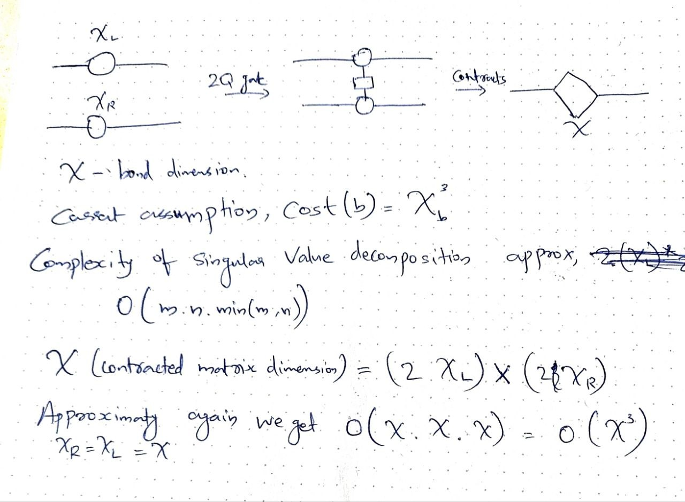

# 4.3 Validation of the Existing SWAP Cost Model

## 4.3.1 Current Model

The routing algorithm in maestro evaluates many possible SWAP sequences
before selecting one. Executing a full MPS
simulation for every candidate would require repeated tensor
contractions and Singular Value Decomposition (SVD), making the routing
stage computationally more expensive than the simulation itself.
Therefore, maestro employs a lightweight **MPSDummySimulator** that
estimates computational cost instead of performing real tensor
operations.

The dummy simulator assumes that the computational cost of operating on
a bond is proportional to the cube of its bond dimension,

$$
\text{Cost} \propto \chi^3
$$

where $\chi$ is the current bond dimension.

<br>

<br>

This approximation is motivated by the computational complexity of SVD,
which dominates the runtime of MPS algorithms. During a two-qubit
operation, neighbouring tensors are contracted, reshaped into a matrix,
decomposed using SVD, and split again. When the left and right bond
dimensions are similar, the computational complexity is approximately
cubic in the bond dimension.

### Literature

-   U. Schollwöck (2011), *The Density-Matrix Renormalization Group in the Age of Matrix Product States*.
-   R. Orús (2014), *A Practical Introduction to Tensor Networks*.
-   G. Vidal (2003). *Efficient Classical Simulation of Slightly Entangled Quantum Computations.*
-   Xiaocan Li Shuo Wang Yinghao Ca - Tutorial: Complexity analysis of Singular Value Decomposition and its variants(2019)
-   Golub & Van Loan, *Matrix Computations* (2013) 3rd Edition
-   Tomasz Szołdra, Rick Mukherjee, and Peter Schmelcher, “Scalable Preparation of Matrix Product States with Sequential and Brick Wall Quantum Circuits,” arXiv.Org, February 12, 2026.
-   Aydin Deger et al., “Efficiently Simulable Quantum Circuits with Large Entanglement, Magic, and Non-Gaussianity via Code-Compiled Tensor Networks,” arXiv:2607.08396, preprint, arXiv, July 9, 2026.
-   Frank Schindler and Adam S. Jermyn, “Algorithms for Tensor Network Contraction Ordering,” preprint, January 15, 2020.
------------------------------------------------------------------------

## 4.3.2 Assumption 1: Bond dimension is the dominant indicator of computational cost.

The existing implementation assumes that the bond dimension is the
primary factor determining simulation cost.

Higher bond dimensions produce larger tensors, resulting in more
expensive tensor contractions and SVD operations.

Example:

-   χ = 8 → χ³ = 512
-   χ = 64 → χ³ = 262,144

Although the bond dimension increases by only eight times, the estimated
computational cost increases by more than 500 times. This illustrates
why reducing bond dimensions is an effective optimisation objective.

### Advantages

-   bond dimension is indeed major factor.
-   Very inexpensive to compute.
-   Suitable for fast routing decisions.

### Disadvantages

- The model assumes that two bonds with the same bond dimension have identical computational cost.

For example,

Bond A: - χ_left = 4 - χ = 32 - χ_right = 4

Bond B: - χ_left = 64 - χ = 32 - χ_right = 64

Both bonds receive exactly the same estimated cost although the underlying tensor sizes differ significantly. Consequently, the actual computational effort can also differ.

------------------------------------------------------------------------

## 4.3.3 Assumption 2: Cubic scaling approximates SVD complexity

The current implementation uses

$$Cost = \chi^3$$

instead of the complete SVD complexity expression.

This simplification is reasonable because the routing algorithm only needs to compare candidate routes rather than predict exact execution time.


### Strengths

-   Captures the correct asymptotic behaviour.
-   Extremely simple.
-   Very efficient during recursive search.

### Limitations

- The true SVD complexity depends on the dimensions of the reshaped matrix,

$$O(mn\min(m,n))$$

which are determined by both neighbouring bond dimensions.

Therefore, χ³ is only an approximation.

### Literature
-   Xiaocan Li Shuo Wang Yinghao Ca - Tutorial: Complexity analysis of Singular Value Decomposition and its variants(2019)
-   Golub & Van Loan, *Matrix Computations* - Section 5.4.5 3rd Edition
-   U. Schollwöck (2011). *The Density-Matrix Renormalization Group in the Age of Matrix Product States.*

------------------------------------------------------------------------

## 4.3.4 Assumption 3: Bond growth is estimated using constant growth factors:

The dummy simulator predicts bond dimension growth using two fixed
parameters:

-   growthFactorSwap = 0.65
-   growthFactorGate = 0.35

These constants estimate how much the bond dimension increases after SWAPs and two-qubit gates.

### Limitations

Different quantum circuits generate different amounts of entanglement.

For example,

-   QAOA circuits usually generate relatively local entanglement.
-   Random quantum circuits often generate much stronger entanglement.

Despite this difference, both circuit types use exactly the same growth factors.

Consequently, bond growth prediction may become inaccurate for some circuit families.

### Literature

-   R. Orús (2014). *A Practical Introduction to Tensor Networks: Matrix Product States and Projected Entangled Pair States.*
-   G. Vidal (2003). *Efficient Classical Simulation of Slightly Entangled Quantum Computations.*
------------------------------------------------------------------------

## 4.3.5 Assumption 4: Every gate contributes independently.

The accumulated routing cost is computed as

$$TotalCost = \sum \chi^3$$

Each SWAP and two-qubit gate contributes independently to the total cost.

### Strengths

- This additive formulation makes recursive lookahead search computationally feasible.

- Instead of evaluating an entire future simulation exactly, the routing algorithm simply accumulates the estimated cost of individual operations.

### Limitations

- Some routing decisions may appear inexpensive initially but significantly increase future bond dimensions.

**Example:**

```
Step t:       [Qubit 1] --- ( χ_old ) --- [Qubit 2]  <-- SWAP applied here!
                                 ↓
Step t+1:     [Qubit 1] --- ( χ_new ) --- [Qubit 2]  <-- χ increases
                                 ↓
Steps t+2..t+80: Every subsequent gate crossing this bond now costs O(χ_new³) instead of O(χ_old³)
```

The current model only captures this behaviour when sufficient lookahead
depth is available.
## Literature

- Tomasz Szołdra, Rick Mukherjee, and Peter Schmelcher, “Scalable Preparation of Matrix Product States with Sequential and Brick Wall Quantum Circuits,” arXiv.Org, February 12, 2026.
- Aydin Deger et al., “Efficiently Simulable Quantum Circuits with Large Entanglement, Magic, and Non-Gaussianity via Code-Compiled Tensor Networks,” arXiv:2607.08396, preprint, arXiv, July 9, 2026.
- Frank Schindler and Adam S. Jermyn, “Algorithms for Tensor Network Contraction Ordering,” preprint, January 15, 2020.
------------------------------------------------------------------------

## 4.3.6 Overall strengths of the existing model

The existing χ³ cost model provides several practical advantages.

-   It is supported by the theoretical complexity of SVD in MPS
    algorithms.
-   It is computationally inexpensive.
-   It is deterministic and reproducible.
-   It enables efficient recursive lookahead.
-   It scales well to large routing search spaces.
-   It provides a consistent objective function for comparing routing
    alternatives.

Although it is only an approximation, it serves as an effective
optimisation metric because routing primarily requires a reliable
ranking between candidate solutions rather than exact runtime
prediction.

------------------------------------------------------------------------

## 4.3.7 Overall limitations and motivation

The existing model intentionally simplifies several characteristics of
real tensor-network simulations.

In particular, it ignores:

-   neighbouring bond dimensions,
-   gate-specific entanglement generation,
-   circuit-dependent bond growth,
-   memory hierarchy effects,
-   hardware-specific implementation details.

These simplifications make the model extremely efficient but also reduce
its ability to accurately predict real execution time.

Therefore, one of the objectives in this thesis is **not to replace Maestro's
routing algorithm**, but rather to investigate whether the underlying
cost model can be improved while preserving its computational
efficiency.

A more accurate cost function would allow the existing routing algorithm
to make better decisions without fundamentally changing the optimisation
framework.

------------------------------------------------------------------------

## References to Study

1. U. Schollwöck (2011). *The Density-Matrix Renormalization Group in the Age of Matrix Product States.*
2. R. Orús (2014). *A Practical Introduction to Tensor Networks: Matrix Product States and Projected Entangled Pair States.*
3. G. Vidal (2003). *Efficient Classical Simulation of Slightly Entangled Quantum Computations.*
4. G. H. Golub and C. F. Van Loan. *Matrix Computations.*
